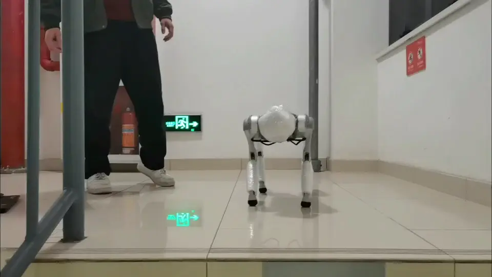

<h1 align="center"> Legged Robots Locomotion </h1>

<p align="center">
    
</p>

**This reposity contains:**

- Learning-based locomotion control, built upon Isaaclab and rsl_rl
- Sim2sim, built upon mujoco
- Sim2real, built upon unitree_guide
- Robots: legged robots, e.g. Unitree GO1 EDU、Limxdynamics TRON1A

**Maintainer:** Guohua Zhang

<p align="center">

</p>

<p align="center">

</p>

<p align="center">

</p>
<p align="center">

</p>

# TODO List

- \[x\] Release the training code.
- \[x\] Release the sim2sim code.
- \[x\] Release the deployment code.

# Locomotion Learning

[](https://docs.omniverse.nvidia.com/isaacsim/latest/overview.html)
[](https://isaac-sim.github.io/IsaacLab)
[](https://docs.python.org/3/whatsnew/3.10.html)
[](https://releases.ubuntu.com/20.04/)
[](https://www.microsoft.com/en-us/)
[](https://pre-commit.com/)
[](https://opensource.org/license/mit)

<p align="center">

</p>

## Installation

- Install Isaac Lab by following the [installation guide](https://isaac-sim.github.io/IsaacLab/source/setup/installation/index.html). We recommend using the conda installation as it simplifies calling Python scripts from the terminal.

- Clone the repository separately from the Isaac Lab installation (i.e. outside the `IsaacLab` directory):

```bash
# Option 1: HTTPS
git clone https://github.com/guohua-zhang/LeggedRobotsLab

# Option 2: SSH
git clone git@github.com:guohua-zhang/LeggedRobotsLab.git
```

- Throughout the repository, the name `ext_template` only serves as an example and we provide a script to rename all the references to it automatically:

```bash
# Enter the repository
cd LeggedRobotsLab
# Rename all occurrences of ext_template (in files/directories) to your_fancy_extension_name
python scripts/rename_template.py your_fancy_extension_name
```

- Using a python interpreter that has Isaac Lab installed, install the library

```bash
python -m pip install -e exts/leggedrobotslab
```

## Run

Unitree GO1 Blind v0

```
python scripts/rsl_rl/train.py --task=Isaac-UnitreeGO1-Blind-Rough-v0 --headless
python scripts/rsl_rl/play.py --task=Isaac-UnitreeGO1-Blind-Rough-Play-v0
```

Unitree GO1 HandStand v0

```
python scripts/rsl_rl/train.py --task=Isaac-UnitreeGO1-HandStand-Rough-v0 --headless
python scripts/rsl_rl/play.py --task=Isaac-UnitreeGO1-HandStand-Rough-Play-v0
```

Unitree GO1 Vision v0

```
python scripts/rsl_rl_vision/train.py --task=Isaac-UnitreeGO1-Vision-Rough-v0 --headless --use_cnn
python scripts/rsl_rl_vision/play.py --task=Isaac-UnitreeGO1-Vision-Rough-Play-v0 --use_cnn
```

Limx TRON1A Blind v0

```
python scripts/rsl_rl/train.py --task=Isaac-PF-Blind-Rough-v0 --headless
python scripts/rsl_rl/play.py --task=Isaac-PF-Blind-Rough-Play-v0
```

# Sim2sim on Mujoco

Refer to [Sim2sim_guidance](./sim2sim_mujoco/README.md)

- Put your own policy into`./sim2sim_mujoco/policy/go1/policy.pt`
- Run the code:

```shell
cd ./sim2sim_mujoco
pip install -r requirements.txt
python unitree_go1_controller_him.py
```

# Deployment on Real Robots

Refer to [Real_guidance](./real/README.md)

# Acknowledgements

- [IsaacLab](https://github.com/isaac-sim/IsaacLab): Our codebase is built upon Isaaclab.
- [rsl_rl](https://github.com/leggedrobotics/rsl_rl): Our codebase is built upon rsl_rl.
- [HIMLoco](https://github.com/OpenRobotLab/HIMLoco/tree/main): Our codebase is referenced from HIMLoco
